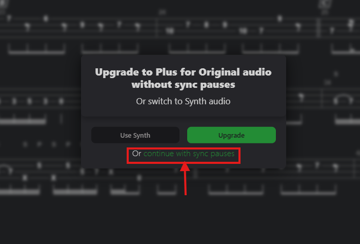
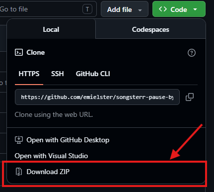

# songsterr-pause-bypasser
<div align="center">



    
</div>
Quick bypass script I wrote for [Songsterr](https://songsterr.com),
a famous tab provider. 
This will close the
pause frame <sub>*almost instantly*</sub> whenever it pops up so you can
continue playing without pressing "Continue with sync pauses" ever again! 

> **NOTE**: This works with Original mode, where you can hear the song while you're playing, of course.

## Installation
### Prerequisites:
- [Python 3.13](https://python.org/)

<sub>Please install this before continuing!</sub>

### Clone the GitHub repository:
If you have `git` (⭐recommended):
```bash
git clone https://github.com/emielster/songsterr-pause-bypasser
``` 
**OR**



and then **unzip.**
### Change directory:
If you have `git`:
```bash
cd songsterr-pause-bypasser
```
**OR** if you downloaded it via the ZIP-way:

Open a Command Prompt (Win + R then type `cmd`) , and go to your Downloads: 

```bash
cd Downloads
```

Then change directory:

```bash
cd songsterr-pause-bypasser-main/songsterr-pause-bypasser-main
```

### Install Python requirements:
Now install the Python requirements:
```bash
pip install -r requirements.txt
```
### Run it!
Finally run the script:
```bash
python3 main.py --poll-interval=0
```
**OR**
```bash
python main.py --poll-interval=0
```
depending on your version.

### Config

#### For help:
```bash
python main.py -h
```

#### `--poll-interval`  argument
This argument configures how many seconds it should wait for checking if the frame is there. Setting it to `0` is the bare minimum, and it is recommended, you'll notice almost no pause. However, for some lower-end devices it is recommended setting a `value` like `0.01` to make your device **not go overflow**. The default is `0.005`.

**Enjoy your music!**

